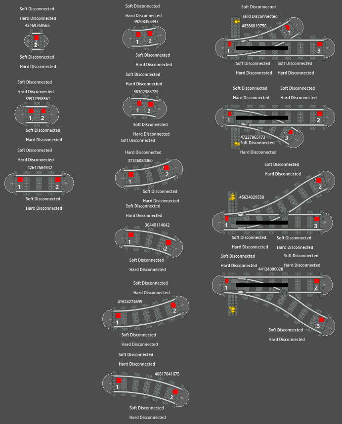

# Rusty Railways Client

This is a [Godot](https://godotengine.org/) based client to create the train track and control/see the status of the train system.

It will (hopefully) let you **Create** and **Edit** the **Train Track**, place the **NFC Tags**, **Trains** and **upload** everything to the Controller,
**Control** and **Monitor** the **High Level Controller**, **Scheduler**, **Trains** and **Switches**.

### Screenshots


https://github.com/MrLakige/rusty_railways/assets/116217951/f5cb0ec4-0af8-4f79-ade2-f686deb53043

https://github.com/MrLakige/rusty_railways/assets/116217951/4c1d8071-14fc-486d-a815-6086c24b4450



### Installation (from pre-made builds)
Download the latest master build for your OS and launch it, [Linux x86_64 Builds](https://github.com/MrLakige/rusty_railways/tree/main/client/build/linux_x86_64), [Windows x86_64 Builds](https://github.com/MrLakige/rusty_railways/tree/main/client/build/windows_x86_64), [MacOS x86_64 Builds](https://github.com/MrLakige/rusty_railways/tree/main/client/build/macos_x86_64)

If you need a build for a different system and/or architecture please follow the [Installation (from source)](#Installation (from source)) section.

### Installation (from source)
Install the latest Godot 4 Version ([Steam App](https://store.steampowered.com/app/404790/Godot_Engine/), [Standalone Installer](https://godotengine.org/download/windows/), [Flatpak (Linux only)](https://flathub.org/apps/org.godotengine.Godot) or [WinGet (Windows only)](https://winstall.app/apps/GodotEngine.GodotEngine))

Clone the repository with 
```bash
git clone https://github.com/MrLakige/rusty_railways.git
```

Open 
```bash
./rusty_railways/client/project.godot
```

Go to `Project` -> `Export...` and select one of the pre-made `Presets` or use `Add...` to add a new custom preset with a different system and/or architecture of your choice.

### TODO
- [ ] Finish Refactoring and Commit Everything remaining
- [ ] Make and Upload all builds
- [ ] Update Screenshots with new GUI (current ones are really old)
