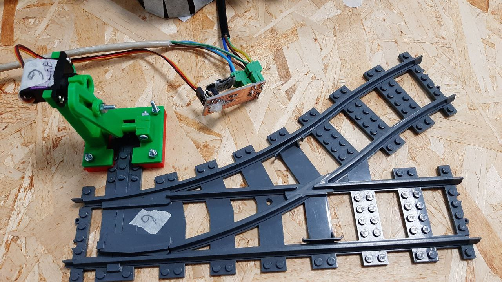
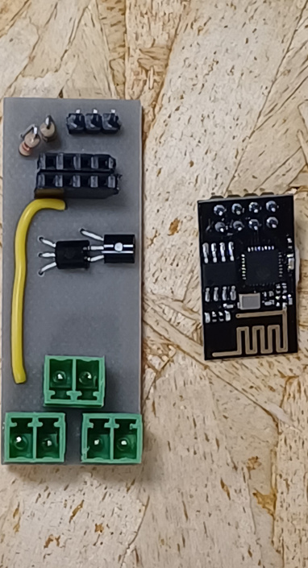
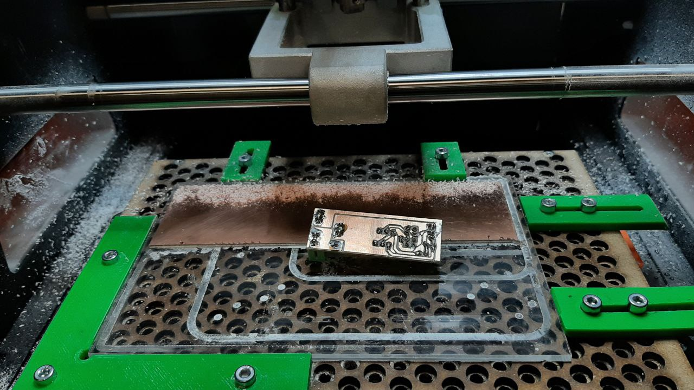

# ESP8266 Rail Track Switch Control System

This section of the repository contains the source code for an ESP8266-based rail track switch control system. The code enables the ESP8266 to function as a web server, offering control over a servo-driven rail track switch. It is designed to set the correct path for trains.



## Features
- The ESP8266 uses a REST API to interface with other components of the project.
- Switch control commands can be transmitted via HTTP POST requests.

## Hardware
- The system utilizes a Servo motor (specifically, the MSG90S) to control the position of the rail track switch.
- WiFi connectivity is established using the built-in wireless functionality of the ESP8266-01S module.

## Code Overview
- The code includes essential libraries such as `ESP8266WiFi`, `WiFiClient`, `ESP8266WebServer`, `Arduino`, `Servo`, and `ArduinoJson`.
- Switch positions are defined based on user-configurable constants.
- The web server responds to HTTP GET requests with information about the switch and handles HTTP POST requests to control the switch position.

## Requirements 
- [PlatformIO](https://platformio.org/platformio-ide) (Follow the [guide to download and configure](https://docs.platformio.org/en/latest/core/installation/index.html))
- PlatformIO compiler toolchain (Download [here](https://registry.platformio.org/platforms/platformio/espressif8266/installation))

## Configuration
1. Modify the WiFi credentials by adjusting the `STASSID` and `STAPSK` constants.
2. Specify the switch characteristics by defining the switch name and position angles in the code.

## Usage
1. Connect the ESP8266 to the rail track switch control mechanism.
2. Flash the firmware using the provided curl command or preferred method.  
   Command: `platformio run --target upload`

### Troubleshooting
#### If a library is not found
1. Run:  
    ```bash
    pio lib install
    pio update
    ```
#### If PlatformIO is not found
1. Ensure that PlatformIO and the toolchain are installed correctly.
2. Verify that the PlatformIO global variable is set.  
   Command: `source /your_local_path_to/ENV/bin/activate`

## Supported Hardware Parts:
>[!CAUTION]
>⚠️ **BASIC CNC AND ELECTRONICS KNOWLEDGE IS NEEDED TO REPRODUCE BELOW STEPS** ⚠️
### PCB
Files to create the PCBs are located here "switch/hardware/Switch_PCB"
#### To Design and Mill a PCB:
You will require the following software:
- [KiCad](https://www.kicad.org/)
- [FlatCAM](http://flatcam.org/)
- GRBL Controller, like [Candle](https://github.com/Denvi/Candle)

#### To mill the PCB of the Switch:
>[!IMPORTANT]
>GRBL Controller or a GCode for CNC/NC controller for your CNC is required.
1. Download the .nc files in the "switch/hardware/Switch_PCB/FlatCAM/OutputFiles"
2. Load in the CNC Program / NC Code Feeder the file with F_Cu in his name, to make the isolation of the traces of the PCB circuit.
3. Then load in this sequence the following files: 0.8mm, 1.0mm, Edge_Cuts.

___
### Images for reference

<p float="left">
   
   
</p>




