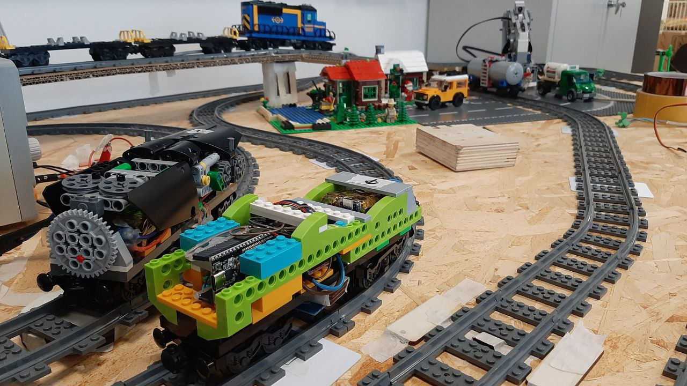
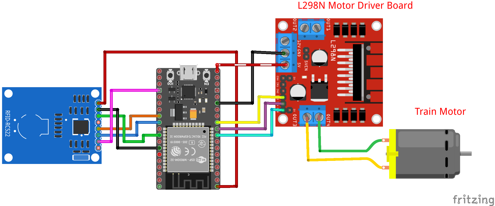

# Locomotive Part

## Description

This section of the repository focuses on the train component of the project. Each train is equipped with an `ESP-WROOM-32` for motor control and communication via WiFi, along with an NFC RFID reader. The code is written in Rust, based on the Rust Embedded HAL framework. The benefits of using Rust Embedded include a common infrastructure used among all projects, better code reusability, and better memory safety.



## Hardware schematics



 - Motor control pins:
    - pwm_pin      -> `GPIO25`
    - forward_pin  -> `GPIO26`
    - backward_pin -> `GPIO27`
 - NFC reader pins:
    - SCK          -> `GPIO15`
    - MISO         -> `GPIO16`
    - MOSI         -> `GPIO17`
    - SS/Reset     -> `GPIO18`

## Features

The features include reading NFC tags placed on the track, WiFi communication, and motor control. Each feature is implemented in specific files according to the Rust HAL framework.

## Hardware

Trains locomotives are composed of an `ESP-WROOM-32`, `H-bridge L298N`, `NFC/RFID reader MFRC-522`, and a `Li-Ion custom battery pack`.

## Requirements

Before proceeding, ensure that the main requirements are installed. Refer to the [main project guide](../../README.md) for details. Follow [this guide](https://github.com/esp-rs/esp-idf-template/tree/master#prerequisites) to download and install all the necessary files and toolchains required to run this part of the project.

### If Some Libraries Are Missing:

1. Run the following command to install the required dependencies:
    ```bash
    sudo apt-get install git wget flex bison gperf python3 python3-pip python3-venv cmake ninja-build ccache libffi-dev libssl-dev dfu-util libusb-1.0-0
    ```

2. If facing issues installing **libuv-dev**, follow this [solution](https://stackoverflow.com/questions/32438367/install-libuv-on-ubuntu-12-04):
    ```bash
    sudo apt-get install libudev-sys
    sudo apt-get install libudev-dev 
    ```

## Compile and Execution

1. Initialize:
   ```bash
   make init
   ```
3. Compile:
   ```bash
   make build
   ```
5. Connect the ESP32 and flash:
   ```bash
   make flash
   ```
7. (Optional) For debugging, check the serial output:
   ```bash
   make monitor
   ```
